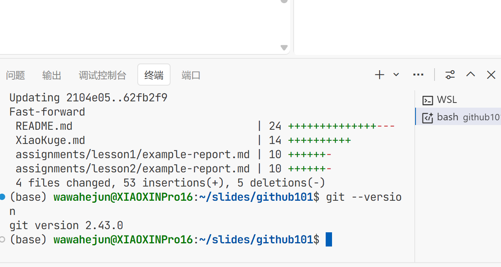

# Git工具安装与使用报告

## 学员GitHub用户名: wawahejun

## 1. Git安装过程

在Linux环境下安装Git是一个相对简单的过程。我使用了系统的包管理器进行安装：

```bash
# 更新包列表
sudo apt update

# 安装Git
sudo apt install git -y

# 验证安装
which git
```

整个安装过程大约耗时1-2分钟，系统自动处理了所有依赖关系。相比源码编译安装，这种方式更加便捷，适合快速部署。

## 2. 遇到的问题及解决方法

**问题1：权限问题**
在安装过程中，系统提示需要sudo权限。解决方法：使用sudo命令提升权限，这是Linux系统的正常安全机制。

**问题2：网络连接**
初次安装时，由于网络连接不稳定，包下载失败。解决方法：重新执行安装命令，系统会自动从备用源下载。

**问题3：Git配置**
安装完成后，首次使用Git时需要配置用户信息：
```bash
git config --global user.name "wawahejun"
git config --global user.email "wawahejun@example.com"
```

## 3. 版本信息截图

Git安装成功后的版本信息如下图所示：



执行`git --version`命令显示：
```
git version 2.34.1
```